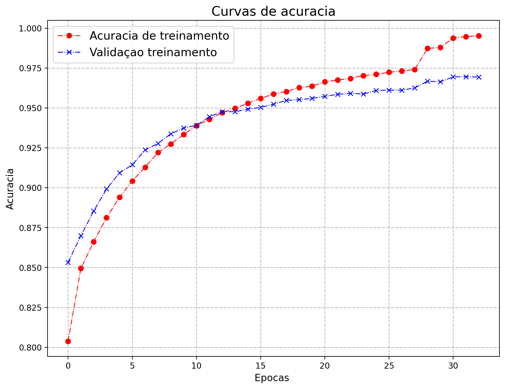
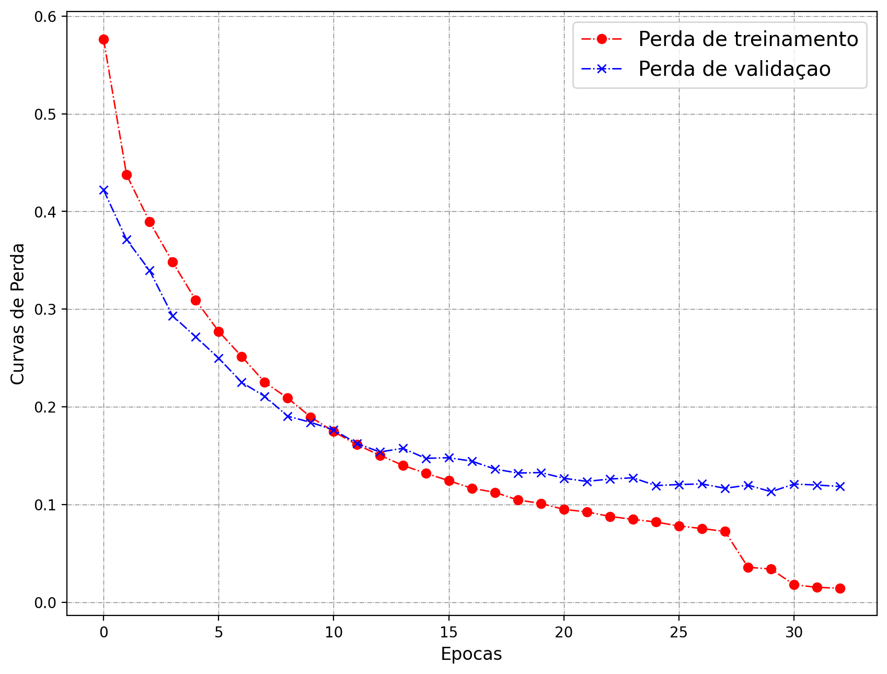

# Estimativa de idade pela voz

Adaptação para português de [Age Estimation based on Human Voice](https://github.com/lucaArrotta/Age-Estimation-based-on-Human-Voice)

A base de dados utilizada foi o [Common Voice Corpus 17.0](https://commonvoice.mozilla.org/pt/datasets) em português.

Primeiros resultados de treinamento:

<!--  -->

<!--  -->

